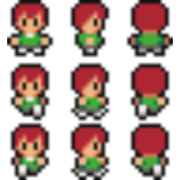
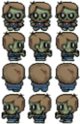
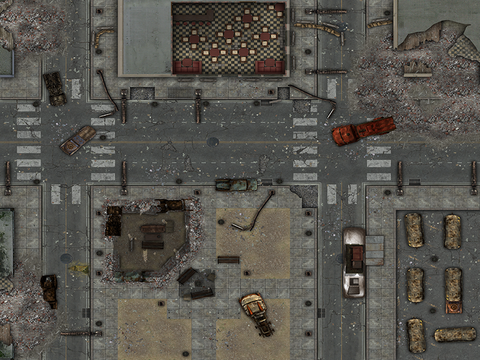

# Story

In a post-apocalyptic world where zombies have enslaved the Earth and taken control, you play as a survivor whose only goal is to survive this zombie invasion. Those walking creatures won't stop coming toward the player. They come crawling from every corner of the map to kill this lone survivor. With every wave their number and speed increase, which makes this endless fight challenging. Our player is equipped with a machine gun to fight back and after every wave, he gets stronger and faster.

# Gameplay

## Player

The player will be controlled using mouse and a keyboard. He will be moving around the map in all directions, holding a machine gun and shooting at the zombies.
To move the player:

- PRESS "Z" : To move UP
- PRESS "S" : To move DOWN
- PRESS "D" : To move RIGHT
- PRESS "Q" : To move LEFT
  To shoot at the zombie :
- Point the mouse at the direction of the zombies
- PRESS "LEFT MOUSE KEY" to shoot

## Zombies

Here below an image of the type of zombies that will attack the player. The zombies will follow the player where ever he goes on the map and won't rest until they kill him.

## Score

Every zombie killed in the game will increase the score by 1.

## Game Over

The game will end when a zombie touchs the player. The score reached by player will be shown and saved into an external API.

# Developer's Notes

This project was developed in these stages:

- Stage 1: Learning how to use Phaser 3, following tutorials and how to setup a game's structure built with Javascript (2 days).
- Stage 2: Creating the GDD (0.5 day).
- Stage 3: Creating the project's codes organizational structure (0.5 day).
- Stage 4: Creating the project's scenes (2 day)
- Stage 5: Creating functions to save the player's score and get top scores (0.5 day).
- Stage 6: Adding sound effects and testing functions using Jest (0.5 day).
- Stage 7: Testing the gameplay, fixing bugs and deployment (1 day).

# Making Of

This project was built using [Phaser 3](https://phaser.io/phaser3), [Webpack](https://webpack.js.org/) and Javascript.

# Acknowledgements

- This project is the Javascript Capstone project and is part of [Microverse](https://www.microverse.org/) curriculum, which am proud to be part of. At Microverse, I learned how to code and build amazing projects. Also, Microverse provided me with an [API](https://us-central1-js-capstone-backend.cloudfunctions.net/api/) to save the player's scores.

- Thanks to [OpenGameArt](https://opengameart.org/) for providing the free assets I used in this game.

- Thanks to [Altegore](https://www.deviantart.com/altegore) from DevianArt the amazing map I used in this game!
  
