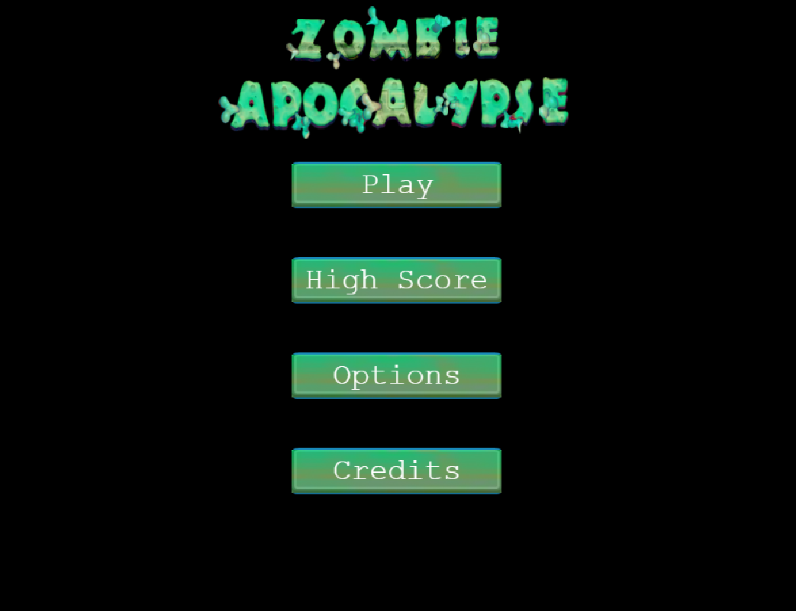
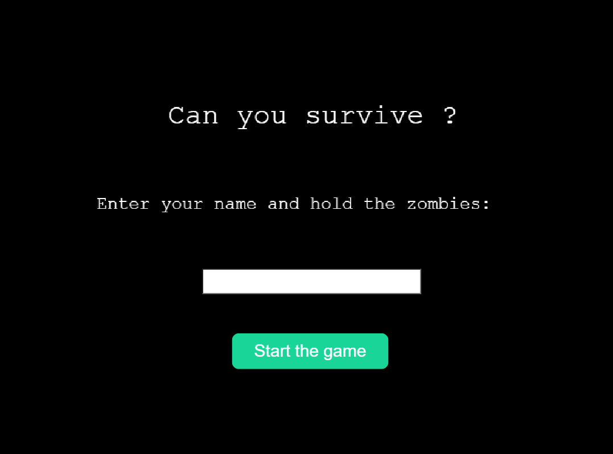
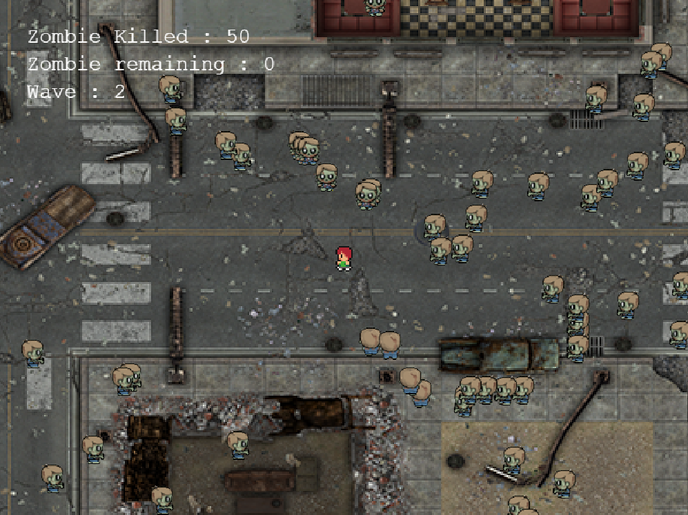
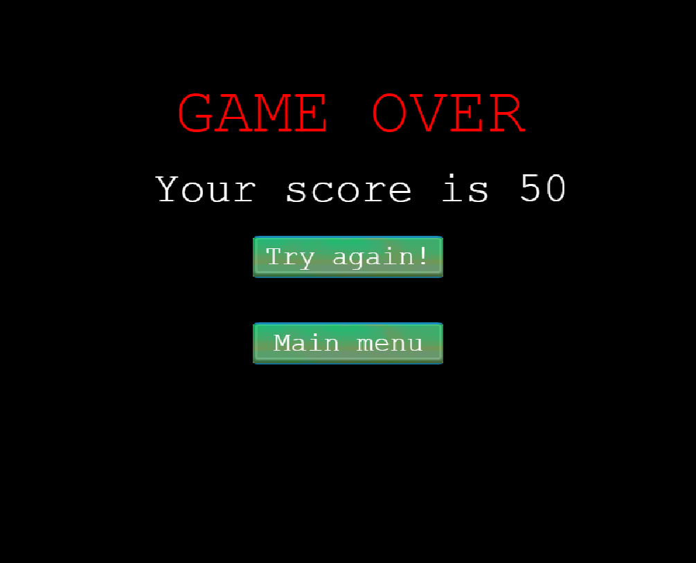

# Zombie Apocalypse Game


## Description

> Zombie Apocalypse is an RPG game that you can play directly from your browser without any prior installation. It was built using the Phaser 3 Game Framework & Javascript and compiled with Webpack. Please read the [Game Design Document](#game-design-document) for further information about the story and the gameplay.

## Game Design Document

[Game Design Document](./GAME_DESIGN_DOCUMENT.md)

## Library Directory 📙

| Contents                      |
| ----------------------------- |
| [Instructions](#instructions) |
| [Live Demo](#live-demo)       |
| [Screenshots](#screenshots)   |
| [Built With](#built-with-🛠)   |
| [Setup](#setup-⏳)            |
| [Testing](#testing-⚙️)        |
| [Authors](#authors)           |
| [License](#license)           |

## Instructions

You can control the player using a mouse and a keyboard. You can move around the map in all directions, holding a machine gun and shooting at the zombies.

To move the player:

- PRESS "Z" : To move UP
- PRESS "S" : To move DOWN
- PRESS "D" : To move RIGHT
- PRESS "Q" : To move LEFT

  To shoot at the zombie :

- Point the mouse at the direction of the zombies
- PRESS "MOUSE LEFT KEY" to shoot

## Live Demo

[Live demo](https://khalilhamdii.github.io/zombie_apocalypse/)

## Screenshots









## Built With 🛠

```
- Javascript
- Phaser 3 Game Framework
- Tiled Map Editor
- HTML
- CSS
- VS Code
```

## Setup ⏳

> Follow these steps to setup this web application locally :

1. - [ ] Open your `Terminal`.
2. - [ ] Navigate to the directory where you will like to install the repo by running `cd FOLDER-NAME`
3. - [ ] Run `git@github.com:khalilhamdii/zombie_apocalypse.git` to download <b>or</b> you can download using `HTTPS` by running `git clone https://github.com/khalilhamdii/zombie_apocalypse.git` in the terminal.
4. - [ ] Run `cd zombie_apocalypse` to enter directory.
5. - [ ] Run `npm install` to install node packages and dependencies.
6. - [ ] Run `npm run start` in your browser to start the application.

## Testing ⚙️

> We have used [rspec](https://jestjs.io/) testing tool to test functions by creating several test cases. Please follow below steps to run Jest testing tool:

1. - [ ] Open `Terminal` again
2. - [ ] Run `cd zombie_apocalypse` to enter directory
3. - [ ] Run `npm run test` to start testing
4. - [ ] All tests will pass ✅

## Authors

### 👨‍💻 Khalil Hamdi

[](https://github.com/khalilhamdii) <br>
[](https://www.linkedin.com/in/khalilhamdi/) <br>
[](mailto:khaalil.hamdi@gmail.com) <br>
[](https://twitter.com/Khalilhamdiii)

### 🤝 Contributing

Contributions, issues and feature requests are welcome!

Feel free to check the [issues page](https://github.com/khalilhamdii/MyTodos).

### Show your support

Give a ⭐️ if you like this project!

### License


